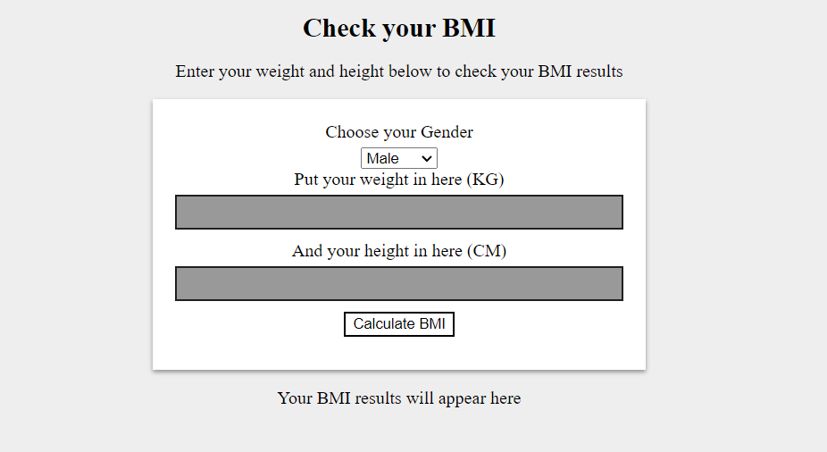
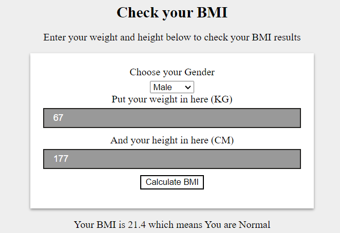

# BMI Calculator
- A simple BMI calculator  
- with nodejs  
- html, css, js as frontend  
  
## Preview 
  
### Homepage  

  

### Calculator



## Run app in your local Machine.  

Clone the Repository.

```
https://github.com/VinayakRaoDikshit/Nano_Project_FSD.git
```

Open the Project in any editor.

```
cd Nano_Project_FSD\
```

Run the app.

If you haven't installed node then first install node, then ...

```
node server.js
```

Change the route to.

```
http://127.0.0.1:8000/index.html
```
